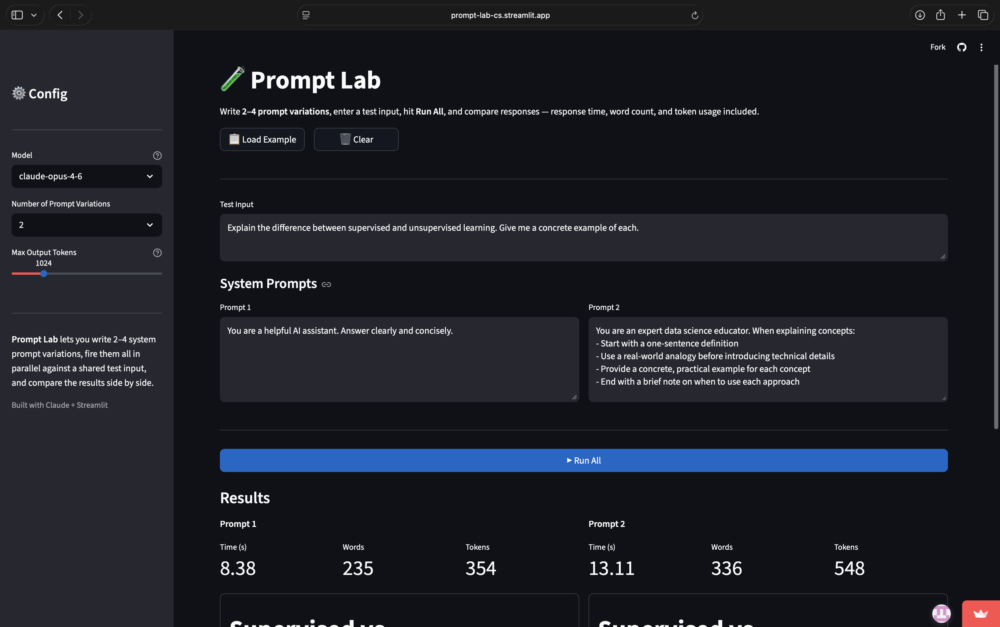

# 🧪 Prompt Lab

[](https://prompt-lab-cs.streamlit.app)



A lightweight tool for testing and comparing Claude prompt variations side by side. Write 2–4 system prompts, enter a shared test input, hit **Run All**, and instantly see how each prompt performs — with response time, word count, and token usage tracked per result.

Built as a portfolio project for an AI Automation Engineering role.

---

## Features

- **Side-by-side comparison** — results displayed in columns for direct visual comparison
- **Parallel execution** — all prompts run concurrently via `ThreadPoolExecutor`, so total wait time equals the slowest prompt, not the sum
- **Per-prompt metrics** — response time, word count, input/output tokens, and stop reason displayed for every prompt
- **Load Example / Clear** — one click to pre-fill all active prompt boxes with a 4-variation showcase, or reset everything
- **Markdown report export** — download a structured `.md` file with all prompts, metrics, and responses
- **Model selection** — switch between `claude-opus-4-6`, `claude-sonnet-4-6`, and `claude-haiku-4-5` from the sidebar
- **Adjustable token budget** — control `max_tokens` per run via a sidebar slider

---

## Tech Stack

| Layer | Library |
|---|---|
| LLM | [Anthropic Claude API](https://docs.anthropic.com) (`anthropic` Python SDK) |
| UI | [Streamlit](https://streamlit.io) |
| Env management | `python-dotenv` |

---

## Project Structure

```
prompt-lab/
├── app.py            # Streamlit UI — layout, state management, display
├── runner.py         # Claude API calls with streaming + timing
├── evaluator.py      # Post-run metric computation (word/char count)
├── utils.py          # Markdown report builder + display helpers
├── requirements.txt
├── .env.example
└── README.md
```

---

## Setup

### 1. Clone & install

```bash
git clone https://github.com/your-username/prompt-lab.git
cd prompt-lab
python -m venv .venv && source .venv/bin/activate
pip install -r requirements.txt
```

### 2. Add your API key

```bash
cp .env.example .env
# Edit .env and set ANTHROPIC_API_KEY=sk-ant-...
```

Get a key at [console.anthropic.com](https://console.anthropic.com/).

### 3. Run

```bash
streamlit run app.py
```

The app opens at `http://localhost:8501`.

---

## Usage

1. **Configure** — pick a model and max output tokens in the left sidebar.
2. **Test Input** — enter the user message you want every prompt tested against.
3. **Prompt Variations** — choose 2–4 variations and write a system prompt in each box.
4. **Run All** — prompts execute in parallel; a spinner shows while they run.
5. **Compare** — results appear side by side with response time, word count, and token usage for each prompt.
6. **Download** — export a structured Markdown report for sharing or archiving.

---

## How It Works

```
app.py  ──►  runner.py        calls Anthropic Messages API (streaming)
        ──►  evaluator.py     adds word_count, char_count to result dict
        ──►  utils.py         renders metrics and builds markdown report
```

`runner.run_prompt()` uses the SDK's `.stream()` context manager and `.get_final_message()` helper — this gives timeout protection for long outputs while still returning a complete `Message` object with accurate `usage` counts.

All prompts are submitted simultaneously via `concurrent.futures.ThreadPoolExecutor`; results are written into a shared dict keyed by prompt index and re-sorted before display to preserve order regardless of which future completes first.

---

## Extending

- **Add a scoring dimension** — drop an extra key into the `evaluate()` return dict; it will appear in the report automatically.
- **Persist history** — serialize `st.session_state` results to JSON/SQLite between sessions.
- **Multi-turn testing** — extend `runner.run_prompt()` to accept a `messages` list instead of a single string.
- **Batch mode** — use the Anthropic Batches API (`client.messages.batches`) for large test sets at 50% cost.
